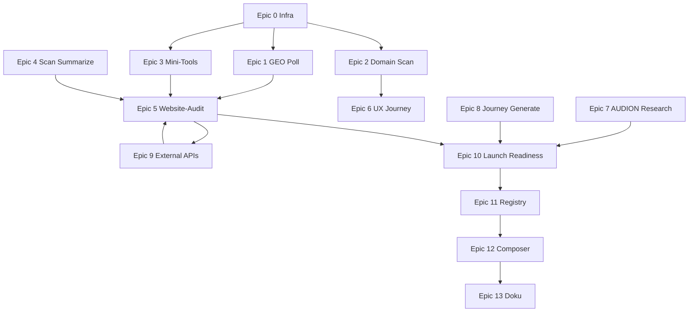

# PLEXON Assistant — Phase 2: Playbooks, Async-Workflows & External Insights

Stand: Juni 2026  
Status: **Plan** (noch nicht umgesetzt)  
Vorgänger: Phase 1 (Epics 0–13) — abgeschlossen, 276 Tests grün

## Vision

Der Assistent wird vom **Einzel-Workflow-Orchestrator** zum **Analyse-Playbook-System**:

- Lange Jobs (Domain-Scan, GEO, Research) mit **Live-Polling** und `step_list`
- **Verkettete Playbooks** (z. B. Website-Audit) mit einem Gesamt-Report
- CHECKION-Tools, die heute nur im MCP existieren, als **deterministische Workflows + UI**
- Wenige **kostenlose Drittanbieter** über eine zentrale Integration-Schicht
- Skalierbare **Workflow-Registry** statt wachsender `complete-handler`-Kette

**Kernprinzip (unverändert):**

```
Intent-Router → Workflow ODER Playbook-Engine ODER runAssistantAgent
Workflow/Playbook → REST/MCP-Client → build-*-ui.ts → metadata.uiLayout (ui_composed)
Agent → plexon_ui_* + MCP → UiBlockAccumulator
```

---

## Ausgangslage (nach Phase 1)

| Bereich | Stand |
|---------|--------|
| Deterministische Workflows | ~12 (Create, Scan, PageSpeed, GEO, Persona, Sync, Research, Status) |
| GEO | Start + **einmaliger** GET — kein Poll auf `/status` |
| Domain-Scan | Nur via Free-Chat/MCP, kein Assistant-Workflow |
| CHECKION Tools | SSL, Wayback, Contrast, Readability, Summarize — **nicht** als Intent |
| Playbooks | Nicht vorhanden |
| Drittanbieter | Nur indirekt (PageSpeed, Wayback via CHECKION) |
| `complete-handler.ts` | Monolith — wird ab ~20 Workflows unübersichtlich |

**Referenz-Implementierungen zum Kopieren:**

- Polling: `lib/assistant/workflows/parallel-research.ts` (`POLL_INTERVAL_MS`, `MAX_POLL_MS`)
- Step-Updates: `lib/assistant/workflows/quick-scan.ts` (`setStep`)
- UI-Builder: `lib/assistant/ui-blocks/build-geo-ui.ts`, `build-scan-result-ui.ts`
- Pfade: `lib/paths/checkion-api.ts`, `lib/paths/audion-api.ts`

---

## Architektur-Erweiterungen (Phase 2)

### A) Gemeinsame Polling-Utility

**Neu:** `lib/assistant/poll-until.ts`

```typescript
pollUntil<T>({
  fetch: () => Promise<{ done: boolean; value?: T; progress?: number }>,
  intervalMs: 3000,
  maxMs: 10 * 60 * 1000,
  onTick?: (progress) => void,
})
```

- Wiederverwendung in GEO, Domain-Scan, Journey-Agent, AUDION Research
- `onTick` → `updateAssistantWorkflowRun` für SSE-Live-`step_list`

### B) Playbook-Engine

**Neu:** `lib/assistant/playbooks/`

| Datei | Zweck |
|-------|--------|
| `types.ts` | `PlaybookDefinition`, `PlaybookStep`, `PlaybookContext` |
| `registry.ts` | `registerPlaybook`, `getPlaybook(id)` |
| `runner.ts` | Sequenzielle + optionale parallele Schritte, Aggregation |
| `website-audit.ts` | Definition Website-Audit |
| `launch-readiness.ts` | Definition Launch-Readiness |
| `build-playbook-report-ui.ts` | `summary_card` + `metric_grid` + `chart` + `collapsible` |

**Intent:** `{ type: 'run_playbook'; playbookId: string; url?: string; ... }`

**Prompt-Erkennung:** `website audit`, `vollständige analyse`, `launch readiness`, `onboarding audit`

### C) External-Integrations-Schicht

**Neu:** `lib/integrations/external/`

| Client | API | Key nötig? |
|--------|-----|------------|
| `mozilla-observatory-client.ts` | `https://http-observatory.security.mozilla.org/api/v2/...` | Nein |
| `dns-doh-client.ts` | Cloudflare `https://cloudflare-dns.com/dns-query` | Nein |
| `w3c-validator-client.ts` | `https://validator.w3.org/nu/` | Nein |

**Pfade:** `lib/paths/external-apis.ts` — **nie** URLs in Clients hardcoden.

**Env (optional):** `EXTERNAL_API_TIMEOUT_MS`, `EXTERNAL_API_CACHE_TTL_MS`

### D) Workflow-Registry (Refactor)

**Neu:** `lib/assistant/workflow-registry.ts`

```typescript
type WorkflowHandler = (ctx: CompleteHandlerContext) => Promise<void>;
{ intentType: 'quick_scan', handler: handleQuickScanWorkflow, ... }
```

`complete-handler.ts` wird Router: Intent → Registry-Lookup → Handler.

**Reihenfolge:** Epic 11 — nach den ersten neuen Workflows, damit Muster klar ist.

### E) CHECKION API-Pfade erweitern

**Erweitern:** `lib/paths/checkion-api.ts`

| Funktion | CHECKION-Endpunkt |
|----------|-------------------|
| `checkionApiScanDomain()` | `POST /api/scan/domain` |
| `checkionApiScanDomainStatus(id)` | `GET .../status` |
| `checkionApiScanDomainSummary(id, opts?)` | `GET .../summary?light=1` |
| `checkionApiScanDomainSummarize(id)` | `POST .../summarize` |
| `checkionApiGeoEeatStatus(jobId)` | `GET .../geo-eeat/{id}/status` |
| `checkionApiGeoEeatRerunCompetitive(jobId)` | `POST .../rerun-competitive` |
| `checkionApiToolsSsl(host)` | `GET /api/tools/ssl-labs?host=` |
| `checkionApiToolsWayback(url)` | `GET /api/tools/wayback?url=` |
| `checkionApiToolsContrast(url)` | analog MCP `checkion.tools_contrast` |
| `checkionApiToolsReadability(url)` | analog MCP |
| `checkionApiScanSummarize(scanId)` | `POST /api/scan/{id}/summarize` |
| `checkionApiScanJourneyStart(scanId)` | `POST /api/scan/{id}/journey` |

Orientierung: `CHECKION/lib/constants.ts` (`apiScanDomain*`, `apiScanGeoEeat*`)

---

## Epics — kleinteilig & UI-gebunden

Jedes Epic endet mit: **Intent + Workflow/Playbook + `ui_composed` + Tests**.

---

### Epic 0 — Phase-2-Infrastruktur

**Ziel:** Wiederverwendbare Bausteine für alle folgenden Epics.

| Task | Dateien | UI |
|------|---------|-----|
| 0.1 Polling-Utility | `lib/assistant/poll-until.ts` | — |
| 0.2 Playbook-Typen + Registry-Skeleton | `lib/assistant/playbooks/types.ts`, `registry.ts` | — |
| 0.3 CHECKION-Pfad-Erweiterung | `lib/paths/checkion-api.ts` | — |
| 0.4 External-API-Pfade | `lib/paths/external-apis.ts` | — |
| 0.5 `workflow-ui.ts` Konstanten für neue Types | `GEO_POLL_STEPS`, `DOMAIN_SCAN_STEPS`, `PLAYBOOK_STEPS` | `step_list` |
| 0.6 Tests | `__tests__/poll-until.test.ts`, `__tests__/checkion-api-paths.test.ts` | — |

**Akzeptanz:** Polling-Tests mit Mock-Fetch; alle neuen Pfade zentral exportiert.

---

### Epic 1 — GEO async (Polling + Deep Result)

**Ziel:** GEO wartet auf `completed`/`failed`, nicht nur Start+GET.

| Task | Dateien | UI-Blöcke |
|------|---------|-----------|
| 1.1 Status-Client | `checkion-geo-client.ts` → `fetchCheckionGeoEeatStatus`, `pollCheckionGeoEeatJob` | — |
| 1.2 Workflow extrahieren | `lib/assistant/workflows/geo-analysis.ts` (aus `complete-handler` ziehen) | `step_list` live |
| 1.3 UI erweitern | `build-geo-ui.ts` — Status-Badge, Wettbewerber-`chart` (bar), Keywords-`data_table` | `metric_grid`, `chart`, `data_table` |
| 1.4 Optional: Competitive Rerun | Intent-Flag `deep: true` → `rerun-competitive` nach Basis-Job | `step_list` + `alert` |
| 1.5 Intent-Router | bestehende `GEO_PATTERNS` + `geo deep`, `geo vollständig` | — |
| 1.6 Tests | `__tests__/geo-analysis-workflow.test.ts`, Intent-Router | — |

**Akzeptanz:** Simulierter Poll (pending → running → completed); UI zeigt Score auch wenn Job >30s dauert.

**CHECKION-Referenz:** MCP `checkion.geo_eeat_status` → `/api/scan/geo-eeat/{id}/status`

---

### Epic 2 — Domain Deep Scan

**Ziel:** „Scanne die ganze Domain …“ als deterministischer Workflow mit Live-Fortschritt.

| Task | Dateien | UI-Blöcke |
|------|---------|-----------|
| 2.1 Client | `lib/integrations/checkion-domain-scan-client.ts` | — |
| 2.2 Workflow | `lib/assistant/workflows/domain-scan.ts` | `step_list` (validate → start → poll → summary) |
| 2.3 UI-Builder | `lib/assistant/ui-blocks/build-domain-scan-ui.ts` | `metric_grid` (Seiten, Issues, SEO-Score), `data_table` (Top-Issues), `link_list` |
| 2.4 Intent | `domain_scan` — Patterns: `domain scan`, `deep scan`, `ganze domain`, `crawl` | — |
| 2.5 Projekt-Assign | optional `scan_domain_assign_project` wenn `checkionProjectId` im Kontext | `key_value_list` |
| 2.6 Handler | `complete-handler` oder Registry | `ui_composed` |
| 2.7 Tests | Client-Mock, Workflow-Steps, Intent | — |

**Akzeptanz:** `maxPages` Default 50 (env `ASSISTANT_DOMAIN_SCAN_MAX_PAGES`); Abbruch bei Timeout mit `alert` + Link zu CHECKION Deep-Scan.

**UI-Rezept:**

```
step_list → summary_card (Domain, Seiten, Dauer)
→ metric_grid (A11y, SEO, Performance-Aggregate aus light summary)
→ data_table (Top 10 Issues)
→ link_list (CHECKION Deep-Scan, Projekt)
```

---

### Epic 3 — CHECKION Tool-Mini-Workflows

**Ziel:** Einzelchecks ohne Agent — schnell, testbar, composable für Playbooks.

| Workflow | Intent | Client | UI |
|----------|--------|--------|-----|
| `ssl_check` | `ssl`, `zertifikat`, `tls` | `checkion-tools-ssl-client.ts` | `key_value_list` + `alert` |
| `contrast_check` | `kontrast`, `wcag contrast` | `checkion-tools-contrast-client.ts` | `metric_grid` |
| `readability_check` | `lesbarkeit`, `readability` | `checkion-tools-readability-client.ts` | `metric_grid` + `chart` |
| `wayback_check` | `wayback`, `historie`, `archive` | `checkion-tools-wayback-client.ts` | `chart` (line) + `key_value_list` |

| Task | Dateien |
|------|---------|
| 3.1 Shared tools base | `lib/integrations/checkion-tools-client.ts` (GET-Helper) |
| 3.2 Vier Clients + vier `build-*-ui.ts` | je Workflow-Datei unter `workflows/` |
| 3.3 Intents in `intent-router.ts` | Priorität unterhalb Domain-Scan, oberhalb free_chat |
| 3.4 `workflow-ui.ts` INITIAL_STEPS | je Type |
| 3.5 Tests | je Client + Intent + UI-Snapshot |

**Akzeptanz:** Jeder Workflow <15s, `ui_composed`, Fehler als `alert` (nicht nur Markdown).

---

### Epic 4 — Scan Summarize

**Ziel:** Nach Quick-Scan oder als Follow-up LLM-Zusammenfassung.

| Task | Dateien | UI |
|------|---------|-----|
| 4.1 Client | `checkion-scan-summarize-client.ts` | — |
| 4.2 Intent `scan_summarize` | oder Auto-Step am Ende von `quick_scan` wenn `summarize: true` | `collapsible` + `text` |
| 4.3 UI | `build-scan-summary-ui.ts` | `summary_card` + `collapsible` (Markdown-Summary) |
| 4.4 Conversation-Context | `scanId` aus letzter Assistant-Message extrahieren | — |
| 4.5 Tests | Follow-up „fasse den scan zusammen“ | — |

**Akzeptanz:** Quick-Scan-Prompt „… und fasse zusammen“ liefert Scan-UI + Summary-Block.

---

### Epic 5 — Website-Audit Playbook (Flagship)

**Ziel:** Ein Prompt → verkettete Analyse mit Gesamt-Report.

**Definition:** `lib/assistant/playbooks/website-audit.ts`

```yaml
id: website_audit
label: Website-Audit
requires: url
steps:
  - id: pagespeed      # Epic 4 aus Phase 1
    optional: false
  - id: quick_scan
    optional: false
  - id: ssl_check
    optional: true
  - id: contrast_check
    optional: true
  - id: readability_check
    optional: true
  - id: geo_analysis   # Epic 1 (async)
    optional: true
    timeoutMs: 600000
```

| Task | Dateien | UI |
|------|---------|-----|
| 5.1 Playbook-Runner | `playbooks/runner.ts` — sequentiell, Fehler → `optional` skip | Parent `step_list` |
| 5.2 Aggregator | `build-playbook-report-ui.ts` | `summary_card` (Gesamt-Score), `metric_grid`, `chart` (Radar/Bar), `corner_tab_section` (Details pro Schritt) |
| 5.3 Intent `run_playbook` | `website audit`, `vollständige website analyse`, `audit für {url}` | — |
| 5.4 Usage-Tracking | `rawUnits: { playbook: 'website_audit', steps: N }` | — |
| 5.5 Tests | Runner mit gemockten Sub-Workflows; E2E-Smoke erweitern | — |

**Akzeptanz:** Ein Prompt mit URL → ein `workflowRunId` Parent + Sub-Steps sichtbar; CHECKION/AUDION-Links im `link_list`.

**UX:** Lange Playbooks (>2 min) → Zwischen-Message „Audit läuft …“ + SSE; optional Resume in Conversation.

---

### Epic 6 — UX Journey Agent

**Ziel:** CHECKION Journey-Agent als Workflow (nach Single- oder Domain-Scan).

| Task | Dateien | UI |
|------|---------|-----|
| 6.1 Client | `checkion-journey-client.ts` — `startScanJourney`, `pollJourney` | — |
| 6.2 Workflow | `workflows/ux-journey.ts` | `step_list` + `corner_tab_section` (Narrative) |
| 6.3 UI | `build-journey-ui.ts` | `text` / `collapsible` für Journey-Text, `link_list` |
| 6.4 Intent | `ux_journey`, `journey agent`, `nutzerreise` | — |
| 6.5 Input | `scanId` aus Kontext oder URL → Quick-Scan → Journey | — |
| 6.6 Tests | Poll-Mock, Intent | — |

**CHECKION:** `POST /api/scan/{id}/journey` oder Domain-Variante `/api/scan/domain/{id}/journey`

---

### Epic 7 — AUDION Research (Standalone-Workflow)

**Ziel:** „Starte AUDION Research für dieses Projekt“ ohne paralleles CHECKION.

| Task | Dateien | UI |
|------|---------|-----|
| 7.1 Workflow | `workflows/audion-research.ts` — nutzt `audion-research-client` Poll | `step_list` |
| 7.2 UI | `build-audion-research-ui.ts` | `key_value_list` (Run-Status), `data_table` (Chunks/Topics), `link_list` |
| 7.3 Intent | `audion_research` — Patterns: `audion research`, `wissensbasis`, `knowledge aufbauen` | — |
| 7.4 Unterscheidung | `start_research` = parallel; `audion_research` = nur AUDION | — |
| 7.5 Tests | Poll + Intent | — |

---

### Epic 8 — Journey Generate (AUDION)

**Ziel:** Customer Journey aus Persona/Target Group generieren.

| Task | Dateien | UI |
|------|---------|-----|
| 8.1 Client | `audion-journey-client.ts` — `journeys_generate`, `journey_get` | — |
| 8.2 Pfade | `lib/paths/audion-api.ts` erweitern | — |
| 8.3 Workflow | `workflows/audion-journey-generate.ts` | `step_list` |
| 8.4 UI | `build-audion-journey-ui.ts` | `corner_tab_section` (Phasen), optional `AssistantPanel` |
| 8.5 Intent | `journey_generate`, `customer journey`, `nutzerreise generieren` | — |
| 8.6 Planner | `assistant-planner.ts` — Familie `audion_journey` bereits vorhanden → Intent ergänzen | — |
| 8.7 Tests | Client-Mock, UI-Builder | — |

---

### Epic 9 — Kostenlose Drittanbieter (Security & DNS)

**Ziel:** Ergänzung zu CHECKION-Tools, direkt von PLEXON (mit Timeout/Cache).

| Workflow | Intent | Client | UI |
|----------|--------|--------|-----|
| `security_headers` | `security headers`, `mozilla observatory` | `external/mozilla-observatory-client.ts` | `metric_grid` (Grade A–F), `data_table` (Tests) |
| `dns_check` | `dns check`, `mx record`, `spf` | `external/dns-doh-client.ts` | `key_value_list` |
| `html_validate` | `html validierung`, `w3c` | `external/w3c-validator-client.ts` | `alert` + `data_table` (Errors top 20) |

| Task | Dateien |
|------|---------|
| 9.1 External-Clients + Rate-Limit (1 req/s pro Host) | `lib/integrations/external/*` |
| 9.2 In Website-Audit als optionale Steps | `website-audit.ts` update |
| 9.3 Env-Doku | `knowledge/coolify-env-variablen.md` |
| 9.4 Tests | Mock-Fetch für alle drei |

**Nicht in v1:** Common Crawl, NewsAPI, SimilarWeb — zu komplex / Key-Pflicht.

---

### Epic 10 — Launch-Readiness Playbook

**Ziel:** Cross-Product-Onboarding in einem Durchlauf.

**Definition:** `playbooks/launch-readiness.ts`

```
1. create_platform_project (optional wenn kein Kontext)
2. sync_diagnose
3. parallel_research (wenn Domain)
4. website_audit (light: pagespeed + quick_scan + ssl)
5. persona_bootstrap (optional, wenn AUDION binding)
6. summarize_project
```

| Task | Dateien | UI |
|------|---------|-----|
| 10.1 Playbook + Runner-Erweiterung (branching: skip wenn kein Entitlement) | `launch-readiness.ts` | Mega-`step_list` |
| 10.2 UI | `build-launch-readiness-ui.ts` | `summary_card` + Ampel-`metric_grid` (Sync ✓, Research ✓, Audit ✓, Persona ✓) |
| 10.3 Intent | `launch readiness`, `projekt onboarding`, `go live check` | — |
| 10.4 Tests | Entitlement-Mocks (nur CHECKION / nur AUDION / beide) | — |

**Akzeptanz:** Prompt „Richte Projekt X mit Domain Y ein und prüfe alles“ → ein Playbook-Run.

---

### Epic 11 — Workflow-Registry Refactor

**Ziel:** `complete-handler.ts` <200 Zeilen Router-Logik.

| Task | Dateien |
|------|---------|
| 11.1 `workflow-registry.ts` — alle Intents aus Phase 1+2 | |
| 11.2 Handler pro Workflow in `lib/assistant/handlers/*.ts` | |
| 11.3 `complete-handler.ts` — nur Auth, Intent, Registry-Dispatch | |
| 11.4 Playbook-Dispatch separat | `handlers/run-playbook.ts` |
| 11.5 Regression | gesamte Test-Suite grün |

**Akzeptanz:** Kein Verhalten-Change; nur Struktur.

---

### Epic 12 — Composer, Capabilities, Projekt-Bindung

| Task | Dateien |
|------|---------|
| 12.1 Suggested Prompts | `website audit`, `domain scan`, `ssl check`, `launch readiness` |
| 12.2 i18n Labels DE | `ASSISTANT_SUGGESTION_LABELS_DE` |
| 12.3 Capabilities-UI | `capabilities-ui.ts` + `capabilities-overview.ts` — Playbook-Sektion |
| 12.4 Auto-Assign | Workflows mit `checkionProjectId` → `scan_assign_project` / `geo_eeat_assign_project` |
| 12.5 Write-Confirm | `scan_domain`, `geo rerun`, `journey_generate` in `isConfirmationRequiredToolName` |

---

### Epic 13 — Doku, Smoke, Produktion

| Task | Dateien |
|------|---------|
| 13.1 Orchestrator-Doku | `plexon-assistant-orchestrator.md` — Phase-2-Workflows-Tabelle |
| 13.2 Generative-UI-Doku | neue Block-Rezepte für Playbook-Report |
| 13.3 E2E-Smoke | `__tests__/e2e-assistant-smoke.test.ts` — website_audit, domain_scan, geo_poll |
| 13.4 Coolify | neue Env-Vars dokumentieren |
| 13.5 Knowledge-Querverweis | dieses Dokument |

**Gate:** `npm test -- --run` + `npm run build` grün; manuell Staging: Website-Audit gegen echte URL.

---

## Implementierungsreihenfolge (empfohlen)



**Sprint-Vorschlag:**

| Sprint | Epics | Lieferobjekt |
|--------|-------|--------------|
| 1 | 0, 1, 3 (teilweise) | GEO Poll + SSL + Wayback |
| 2 | 2, 3 (rest), 4 | Domain Scan + alle Mini-Tools + Summarize |
| 3 | 5, 9 | **Website-Audit Playbook** + External |
| 4 | 6, 7, 8 | Journey + AUDION Research |
| 5 | 10, 11, 12, 13 | Launch Readiness + Registry + Polish |

---

## UI-Block-Matrix (Phase 2)

| Block | Workflows |
|-------|-----------|
| `step_list` | GEO poll, Domain scan, Playbooks, Journey, Research |
| `summary_card` | Playbook-Report, Launch Readiness |
| `metric_grid` | Domain scan, SSL, External security, Playbook-Ampel |
| `chart` | Wayback, Readability, GEO competitors, Playbook radar |
| `data_table` | Domain issues, GEO keywords, W3C errors, Journey phases |
| `corner_tab_section` | Playbook-Details, AUDION Journey |
| `collapsible` | Scan summarize, lange Reports |
| `alert` | Partial failures in Playbooks, External API errors |
| `link_list` | CHECKION Deep-Scan, GEO job, AUDION Journey |

---

## Nicht-Ziele (Phase 2)

- Kein neues UI-Framework — nur bestehende `plexon_ui` / `ui_composed` Blöcke
- Keine bezahlten SEO-APIs (Ahrefs, Semrush)
- Kein vollständiges Common-Crawl-Indexing
- Kein PDF-Export (optional Phase 3)
- Kein PLEXON-eigener MCP-Server (optional Phase 3: `plexon.playbook_run`)
- Plan-Datei Phase 1 **nicht** anfassen

---

## Phase 3 (Ausblick, nicht Teil dieses Plans)

- Insight Report PDF / Share-Link
- Competitive Snapshot Playbook (multi-URL)
- `plexon.*` MCP für Board + Assistant
- Workflow-Caching & Retry-Policies
- DS-Upstream `MsqdxMetricGrid` → `@msqdx/react`
- Benachrichtigung bei langen Jobs (E-Mail/In-App)

---

## Checkliste pro Epic (Definition of Done)

- [ ] Intent in `intent-router.ts` + Tests
- [ ] REST-Client in `lib/integrations/` (Pfade aus `lib/paths/`)
- [ ] Workflow in `lib/assistant/workflows/` mit `step_list`-Updates
- [ ] `build-*-ui.ts` → `ui_composed`
- [ ] `workflow-ui.ts` INITIAL_STEPS
- [ ] Handler in Registry / `complete-handler`
- [ ] Mindestens 1 Unit-Test Workflow + 1 Intent-Test
- [ ] Capabilities/Suggestions aktualisiert (ab Epic 12 gebündelt, Zwischen-Updates ok)
- [ ] Keine hardcodierten Produkt-URLs

---

## Verwandte Dokumente

- [plexon-assistant-orchestrator.md](./plexon-assistant-orchestrator.md)
- [plexon-assistant-generative-ui.md](./plexon-assistant-generative-ui.md)
- [coolify-env-variablen.md](./coolify-env-variablen.md)
- [checkion-mcp-board-tools.md](./checkion-mcp-board-tools.md)
- CHECKION API-Pfade: `CHECKION/lib/constants.ts`
