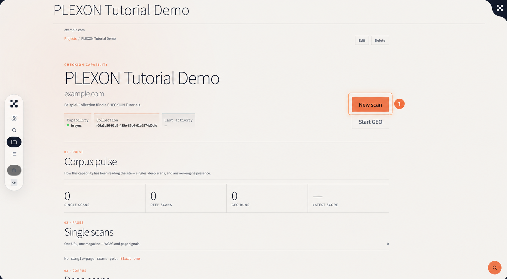
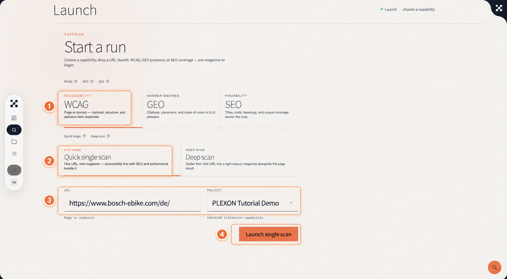
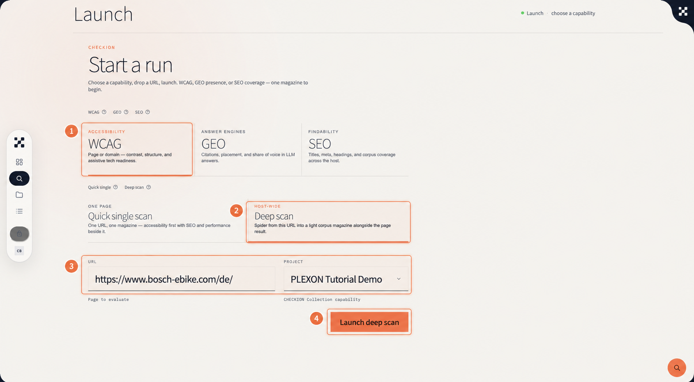
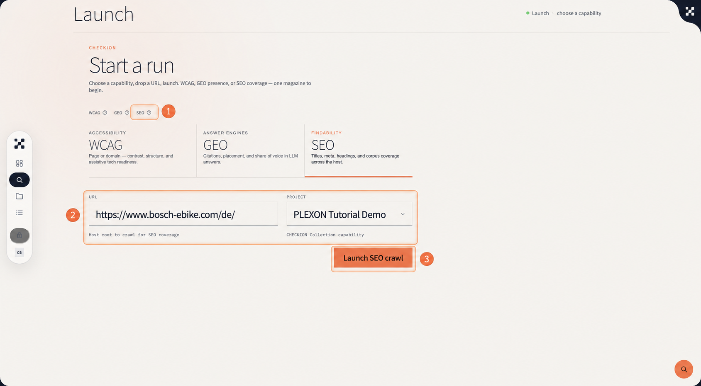
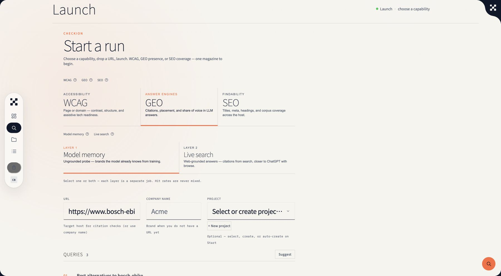

# CHECKION in fünf Prüfungen: Vom ersten Projekt zur GEO-Sichtbarkeit

CHECKION macht aus einer URL keinen isolierten Testfall, sondern einen wiederverwendbaren Prüfkontext: eine **Collection**. Von dort aus lässt sich erst eine einzelne Seite prüfen, dann die Domain als Corpus lesen und schließlich die Präsenz einer Marke in KI-Antworten untersuchen.

Dieser Artikel ist der kompakte Einstieg für Teams, die mit CHECKION beginnen. Die Markierungen in den Bildern folgen der Reihenfolge im Text.

> **Hinweis zur Aufnahme:** Die Screens zeigen einen echten Tutorial-Workspace. Die darin sichtbare URL ist ein UI-Platzhalter. Für eigene Läufe immer eine freigegebene, kontrollierbare Domain einsetzen.

## 1. Einen Arbeitskontext anlegen

Eine neue Prüfung beginnt im Workspace der Collection. In CHECKION erscheint sie aktuell als lokaler Capability-Datensatz; fachlich bleibt sie Teil derselben PLEXON Collection. Der Name, die Domain und die spätere Prüfgeschichte liegen damit an einem Ort.

Wähle im Workspace **New scan**.

Damit ist die wichtigste Entscheidung bereits getroffen: Alle folgenden Ergebnisse gehören zum selben Kontext und lassen sich später miteinander vergleichen.

## 2. Eine einzelne Seite auf WCAG prüfen

Der schnellste sinnvolle Einstieg ist ein **Quick single scan**. Er eignet sich für eine konkrete Seite, etwa eine Landingpage, einen Checkout-Schritt oder einen redaktionellen Beitrag.

1. Wähle **WCAG**.
2. Wähle **Quick single scan**.
3. Gib die konkrete URL ein und ordne sie der richtigen Collection zu.
4. Starte mit **Launch single scan**.

Der Scan läuft asynchron. Öffne danach **Jobs**, um Status und Ergebnis zu verfolgen. Im Ergebnis zuerst die Übersicht lesen, anschließend in einzelne Findings springen. Ein einzelnes Finding ist ein Hinweis; erst Häufungen zeigen, welche Probleme ein systematisches Thema sind.

## 3. Die Domain als Corpus untersuchen

Ein **Deep scan** startet an einer URL und erweitert die Sicht auf mehrere Seiten. So wird aus der Einzelfallprüfung ein Corpus: Wiederkehrende Muster in Struktur, Kontrast, Semantik oder Hilfstechnologien werden sichtbar.

1. Bleibe in **WCAG**.
2. Wechsle auf **Deep scan**.
3. Prüfe Start-URL und Collection.
4. Starte mit **Launch deep scan**.

Für diesen Schritt nur Domains einsetzen, die das Team crawlen darf. Die Auswertung nicht als Liste einzelner Fehler behandeln: Priorität haben Muster, die sich über mehrere Seiten oder Templates hinweg wiederholen.

## 4. SEO-Abdeckung im Corpus prüfen

Die **SEO**-Prüfung nutzt denselben Kontext, beantwortet aber eine andere Frage: Wie gut sind technische und redaktionelle Grundlagen über die Website hinweg abgedeckt?

1. Wähle oben **SEO**.
2. Gib die Host-URL und die zugehörige Collection an.
3. Starte mit **Launch SEO crawl**.

Das Ergebnis ist kein Ranking-Versprechen. Es zeigt Signale und Lücken rund um Titel, Metadaten, Überschriften und Corpus-Abdeckung. Besonders nützlich wird es neben dem Deep scan: Dann lassen sich technische und inhaltliche Muster gemeinsam priorisieren.

## 5. GEO Model Memory: Was Modelle bereits über die Marke wissen

GEO ergänzt die Website-Perspektive um die Frage, ob und wie eine Marke in Antworten von Sprachmodellen vorkommt. Für den Einstieg ist **Model memory** die richtige Schicht: Sie prüft ungestützte Modellkenntnis, nicht aktuelle Websuche.

1. Wähle **GEO** und anschließend **Model memory**.
2. Ergänze URL, Markenname und – falls vorhanden – die Collection.
3. Prüfe die Fragen im Bereich **Queries**: Sie sollen echte Nutzerfragen abbilden, nicht nur den Markennamen wiederholen.
4. Starte den Job und lies Trefferquote, genannte Marken und Quellen getrennt von Live-Search-Ergebnissen.

**Model memory** und **Live search** sind zwei getrennte Messungen. Ihre Trefferquoten dürfen nicht zusammengerechnet werden: Die erste misst vorhandenes Modellwissen, die zweite webgestützte Sichtbarkeit.

## Die sinnvolle Reihenfolge für den Start

Beginne mit einer repräsentativen Einzelpage. Danach den Deep scan einsetzen, um zu prüfen, ob die wichtigsten Probleme systemisch sind. Anschließend SEO-Abdeckung im selben Corpus betrachten. GEO folgt, wenn klar ist, welche Themen, Markenattribute und Fragen für die Sichtbarkeit in KI-Antworten wirklich relevant sind.

So entsteht kein loses Bündel von Scans, sondern eine Prüfungskette: **Seite → Corpus → Findability → GEO-Präsenz**.

---

Weiterführend: Die ausführlichen Produktionsskripte mit Sprechertext liegen in [der CHECKION-Tutorialserie](../checkion-first-five.md).
