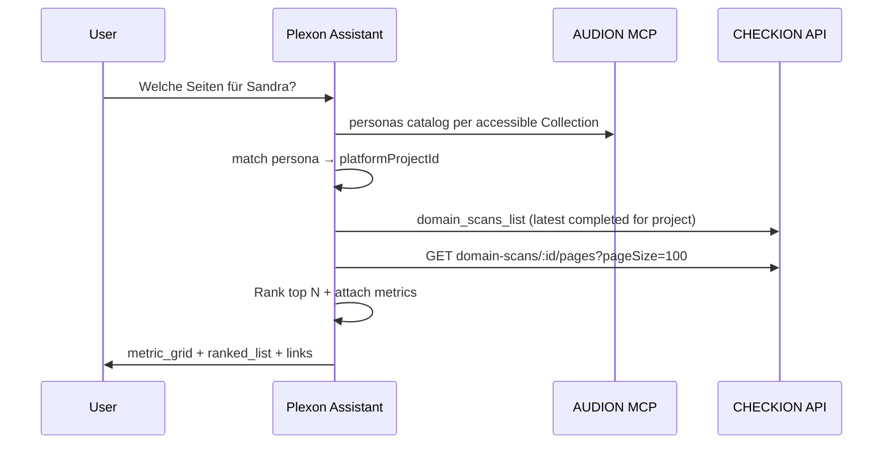

# Assistant · Persona → relevant pages (CHECKION)

**Status:** Accepted — Wave 1 (2026-09-01)  
**Depends:**  
- CHECKION `specs/api/domain-scan-pages.md`  
- AUDION persona read (`audion.persona_get` / platform catalog)  
- `specs/domain/collection-projects.md` (Collection `platformProjectId` + capability mirrors)  
**Demo:** `knowledge/vaillant-group-mafo-demo.md` · UC1 Sandra/Thomas on B2C corpus

## Goal

User asks in Plexon Assistant:

> *Welche Seiten sind für Persona **Sandra** besonders relevant — und wie schneiden die ab?*

Assistant returns a **ranked table** of CHECKION corpus pages with **coarse metrics** and a short **relevance rationale** per row (LLM), grounded in AUDION persona fields + CHECKION scan data.

## Intent

| Field | Type | Notes |
|-------|------|--------|
| Planner intent | `persona_page_relevance` | New; distinct from `audion_persona` (read-only cross-app) |
| Handler type | `persona_page_relevance` | Deterministic prefetch + agent synthesis (hybrid) |

### Routing patterns (German + EN)

- `relevante seiten` + `persona`
- `welche seiten` + `persona|zielgruppe|segment`
- `page relevance` + persona name/id
- `touchpoints` + persona + `website|seiten|urls`
- `wo landet` + persona name

**Requires:** Collection context with `platformProjectId`, **or** a resolvable persona name/id (scan across accessible Collections), or explicit `domainScanId`.

## Flow

### Step 0 — Resolve Collection (when missing)

1. Explicit `platformProjectId` from chat / page context **wins**.
2. Else scan AUDION persona catalogs of Collections the user can access (`listAccessibleCollectionsForUser` + `fetchAudionPlatformProjectSummary`, concurrency-limited).
3. Match `personaId` or `personaName` (exact name preferred over partial).
4. Multiple exact hits without a Collection name in the prompt → ask user to pick a Collection.
5. Else fall back to Collection **name** mentioned in the prompt.
6. On success, persist inferred `platformProjectId` on the conversation for follow-ups.

### Step 1 — Resolve persona

1. Explicit `personaId` in intent payload if router extracted it.
2. Else match `personaName` (case-insensitive) against AUDION catalog for Collection’s AUDION mirror (`fetchAudionPlatformProjectSummary`).
3. Fetch persona detail: goals, pain points, segment, demographics, jobs-to-be-done (fields available on contract).

**Failure:** No persona match → ask clarifying question (list up to 5 persona names).

### Step 2 — Resolve domain scan

1. Explicit `domainScanId` if provided.
2. Else `checkion_v3.domain_scans_list` for CHECKION mirror project → pick **latest `completed`** deep scan.
3. Optional `urlHint` / `seedUrl` from user message → prefer scan whose `rootUrl` host matches.

**Failure:** No completed deep scan → suggest starting domain scan (link to CHECKION project); do not invent URLs.

### Step 3 — Load corpus pages

`GET /api/domain-scans/:id/pages?pageSize=100&sort=score_asc`

- Cap assistant input at **100 rows** Wave 1; if `pageCount > 100`, note truncation in UI.
- Pass to LLM: `url`, `overallScore`, `errors`, `warnings`, `scores` (a11y/seo/perf when present), `classification.shortSummary`, `classification.tags`.

### Step 4 — Rank + explain

- Model: assistant default (Claude Sonnet for board-grade synthesis; planner may use Haiku for routing only).
- Output **5–10 rows** (`topK` default 8, overridable in message: „top 5“).
- Each row **MUSS** cite CHECKION metrics verbatim; relevance text **MUSS** reference persona fields (goal/pain), not invent page content.
- Include CHECKION deep links: `{CHECKION_WEB}/results/{scanId}/overview`.

### Step 5 — UI compose

`lib/assistant/ui-blocks/build-persona-page-relevance-ui.ts`:

| Block | Content |
|-------|---------|
| `summary_card` | Persona name + one-line segment + domain host + scan date |
| `metric_grid` | Corpus size, avg score, pages with errors > 0 |
| `ranked_list` | Rows: url (link), relevance tier (high/medium/low), overallScore, a11y, seo, errors, rationale (1 sentence) |
| `link_list` | Open persona in AUDION · Open domain scan in CHECKION |

## Planner changes

`lib/assistant/assistant-planner.ts`:

- New `PERSONA_PAGE_PATTERNS` (before generic `PERSONA_PATTERNS` so cross-app wins).
- Intent `persona_page_relevance`, mode `hybrid`.
- Tool families: `audion_persona`, `checkion_scan_read`, `plexon_ui`.
- `maxToolRounds`: 6.
- **Requires** `hasAudionMcp && hasCheckionMcp` (or REST clients for both capabilities).

`lib/assistant/tool-catalog.ts`:

- Map `checkion_v3.domain_scan_pages_list` → family `checkion_scan_read`.

## Handler

**New:** `lib/assistant/handlers/persona-page-relevance.ts`

- Registered in `complete-handler.ts` when intent resolves to `persona_page_relevance`.
- Prefetch persona + pages via existing REST clients (`lib/integrations/checkion-domain-scans-v3-client.ts`, Audion platform client).
- Pass structured bundle to `runAssistantAgent` with system appendix listing ranked-output JSON schema OR fully deterministic UI when LLM disabled.

**Env gate (optional):** `ASSISTANT_PERSONA_PAGE_RELEVANCE=1` (default on in staging).

## Acceptance (EARS)

- **WENN** User Persona-Name und Collection-Kontext hat und completed Deep Scan existiert, **MUSS** Assistant ≥ 1 Seite mit CHECKION-Metriken und Begründung liefern.
- **MUSS** keine Seiten-URLs erfinden, die nicht in `DomainCorpusPagesResult.items` stehen.
- **MUSS** bei fehlendem Deep Scan eine actionable Meldung zeigen (Scan starten), nicht halluzinieren.
- **MUSS** Persona-Felder aus AUDION zitieren (Name, Segment, mindestens ein Goal oder Pain Point).
- **SOLANGE** `classification.tags` leer sind, **MUSS** Ranking URL-Pfad + Scores + Persona-Kontext nutzen (degraded mode — kein Fehler).

## Wave 2

See `specs/domain/persona-page-relevance-wave2.md` and `knowledge/persona-page-relevance-wave2-roadmap.md`.

- AUDION `site-topics` port (Wave 2 — improves tag signal)
- Real `classifyPageWithLlm` in CHECKION (Wave 2)
- Journey-agent findability per page
- Write actions (scan start) without explicit user confirmation
- audion-v3 native MCP (uses v2 MCP or REST until ported)

## Paths

Document in `knowledge/paths.md`:

- CHECKION: `checkionDomainScanPagesList(domainScanId, query)`
- Plexon handler + UI builder paths

## Tests

- Planner: „Welche Seiten für Persona Sandra?“ → intent `persona_page_relevance`, families include `checkion_scan_read`
- Handler fixture: persona + 5 pages → ranked_list length ≤ 8, URLs subset of input
- Guard: no scan → error card, no fake URLs
